### Table 1: Variance of entropy estimator (1000 samples) across methods and dimensionalities

BF Jacobian denotes ground truth. Methods with prefix FP use finite-difference FP/FP++, where the number indicates the number of probes (e.g., FP1 uses 1 probe per estimate). Methods denoted as Gk and Rk correspond to Hutchinson estimators using Gaussian and Rademacher probes respectively, where k indicates the number of probes.

| Method   | GMM 10D | GMM 100D | GMM 1000D |
|----------|--------:|---------:|----------:|
| BF Jacobian | 0.9265 | 1.5931 | 11.0544 |
| FP1      | 1.6886 | 10.2365 | 37.6025 |
| FP2      | 1.4847 | 8.0238 | 35.3451 |
| FP5      | 1.1487 | 6.5414 | 31.2574 |
| FP10     | 0.9597 | 5.3718 | 29.4457 |
| FP1++    | 0.9456 | 1.8040 | 11.4718 |
| FP2++    | 0.9393 | 1.6681 | 11.3622 |
| FP5++    | 0.9259 | 1.6174 | 11.1046 |
| FP10++   | 0.9255 | 1.6193 | 11.1099 |
| G1       | 1.1992 | 2.7067 | 12.8340 |
| G2       | 1.1018 | 2.1713 | 12.0969 |
| G5       | 0.9930 | 1.8662 | 11.5580 |
| G10      | 0.9503 | 1.7211 | 11.2355 |
| R1       | 0.9394 | 1.7396 | 11.3268 |
| R2       | 0.9378 | 1.6757 | 11.1838 |
| R5       | 0.9266 | 1.6275 | 11.1346 |
| R10      | 0.9281 | 1.6109 | 11.0810 |

## FP++ Convergence Analysis
The x-axis shows the number of independent runs (M). The y-axis shows the estimation error, defined as the average absolute difference between the estimated Jacobian determinant and the ground-truth value, averaged over both runs and a fixed set of samples (number=5). The plot illustrates how the estimation error decreases as M increases, demonstrating the convergence behavior of the estimator.
### 10D

  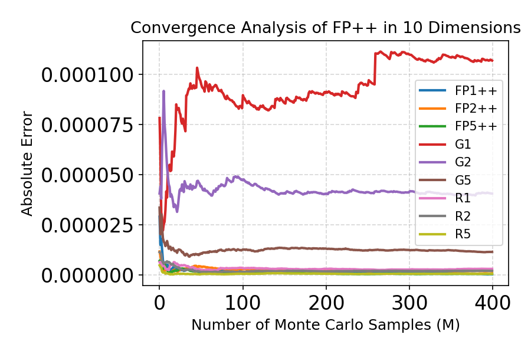

### 100D

  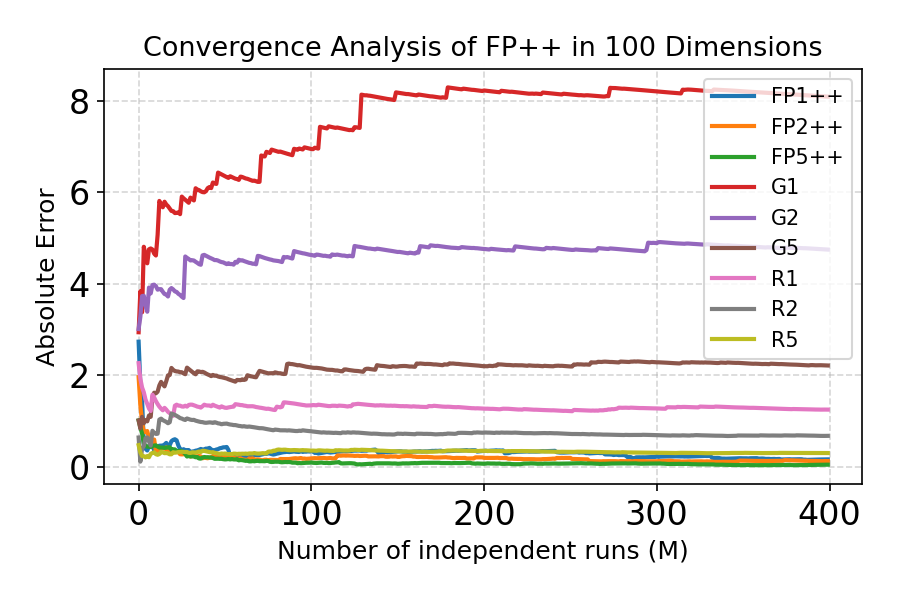

### 1000D

  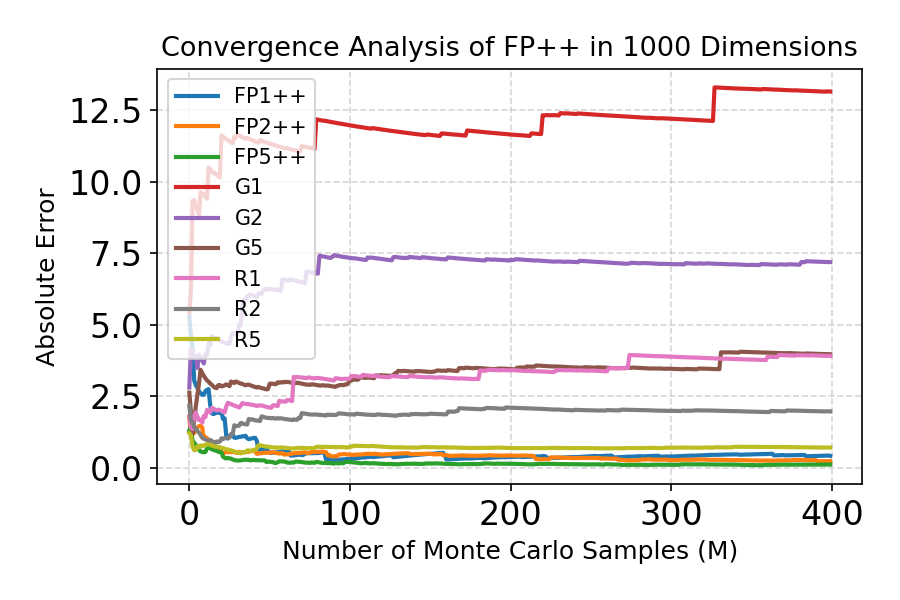

## FP++ Convergence Analysis (JVP vs Finite Difference)
FP++ (finite) uses $\delta = 0.001$.
### 10D

  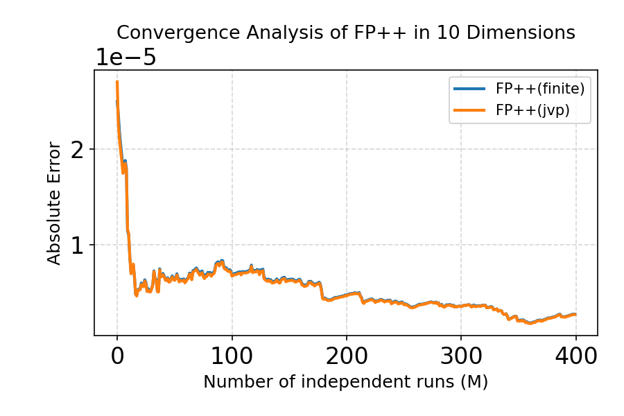

### 100D

  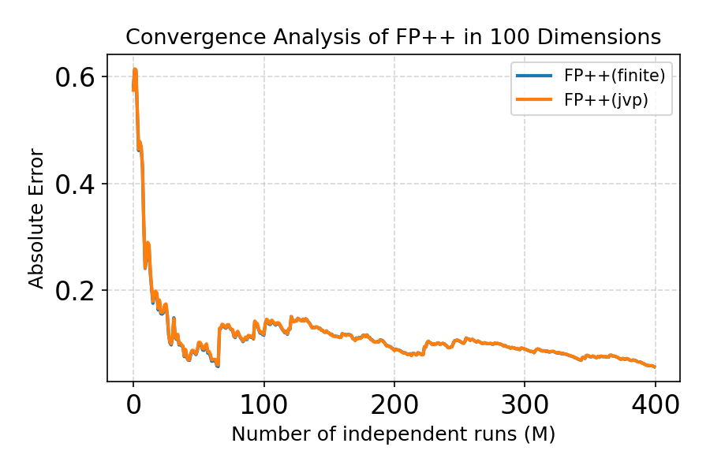

### 1000D

  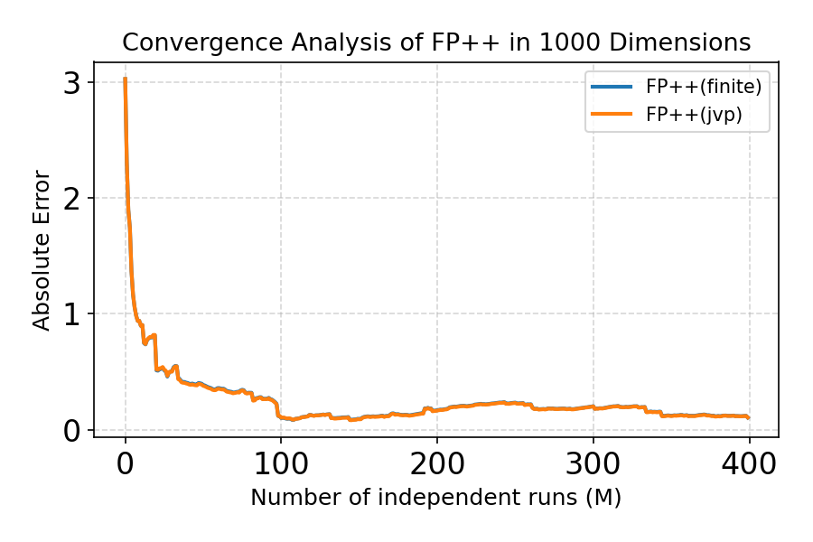

## Effect of finite-difference step size $\delta$ in FP++
FP++ results are shown with different finite-difference step sizes $\delta$. 
The notation “FP++(0.5)” indicates the FP++ estimator evaluated with $\delta = 0.5$. 
Similarly, other curves labeled with values in parentheses correspond to different choices of $\delta$.

### 10D

  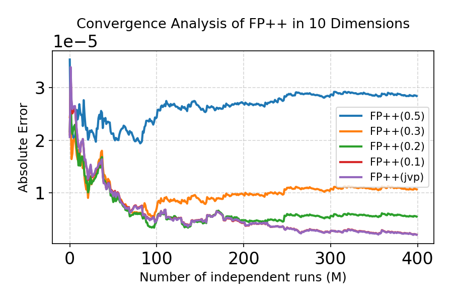

### 100D

  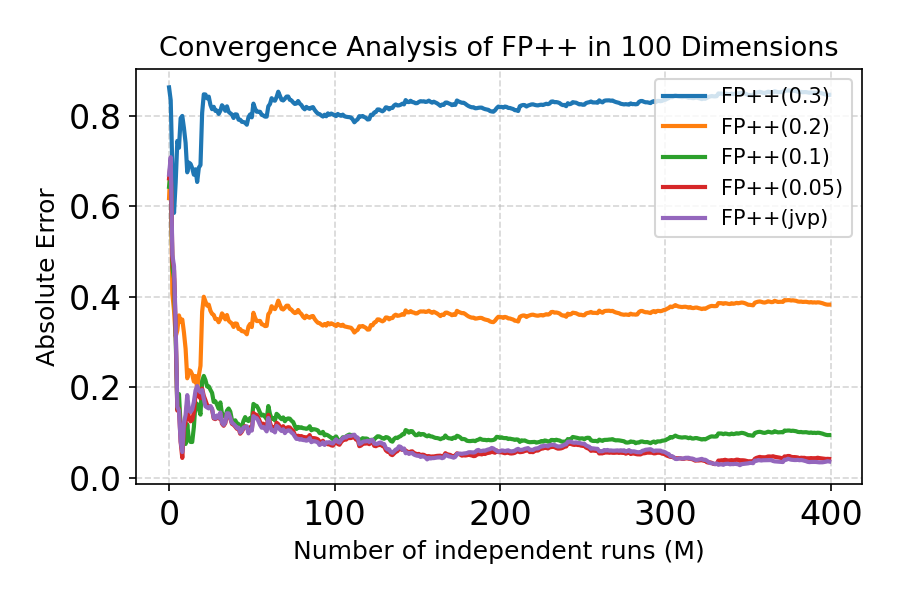

### 1000D

  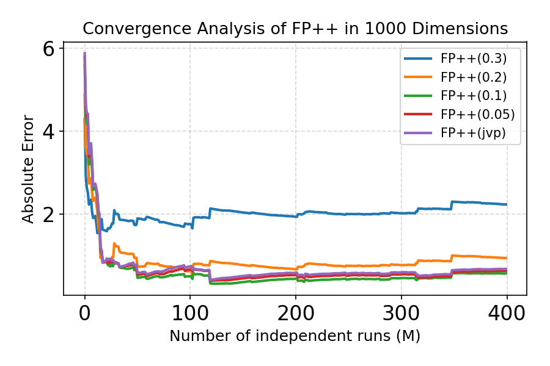

## Chignolin mutant

  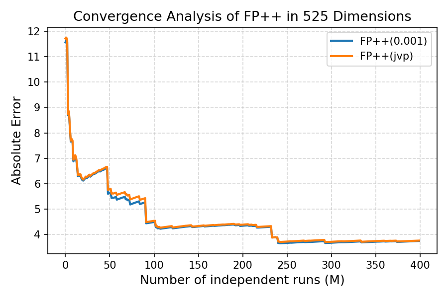

## Feynman-Kac Correctors (FKC) Results on GMM 10D Benchmark

In the figure, “neg ratio” denotes the fraction of samples with the first dimension less than 0, which corresponds to one mode of the mixture. The target ratio is 0.25, reflecting the desired 25/75 mixture proportion. 

### Annealed SDE + FKC

  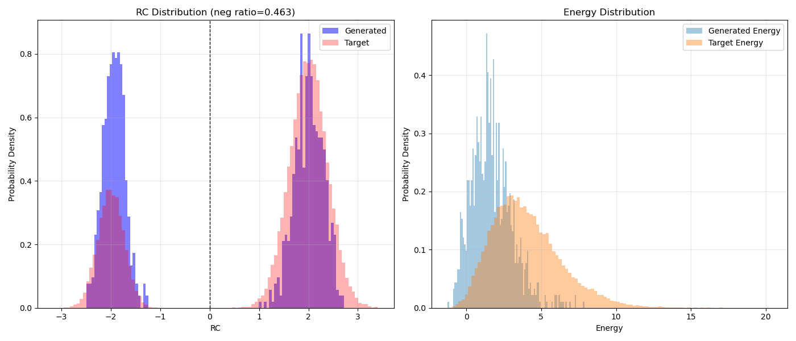

### Reward-tilted Target + FKC

  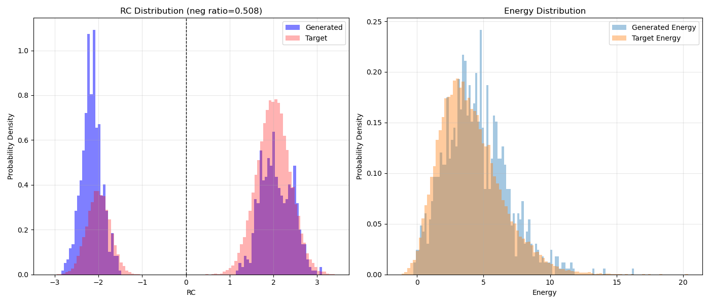

### RNE

  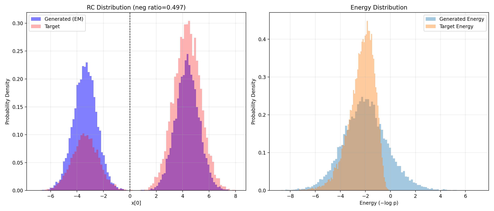

## Jacobian determinant accuracy under fully analytical 2D GMM benchmark
We evaluate FP++ under a fully analytical 2D Gaussian Mixture Model, where both the velocity field and its Jacobian are available in closed form. Initial points are uniformly sampled, and we report the mean Jacobian determinant over time $t \in [0,1]$. The results show that FP++ closely matches the analytical ground truth throughout the entire time interval.

  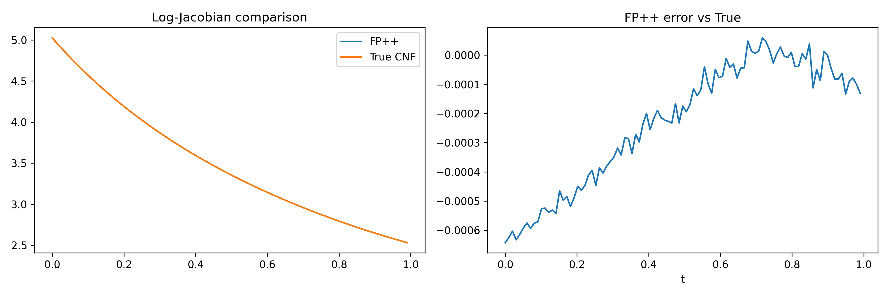

