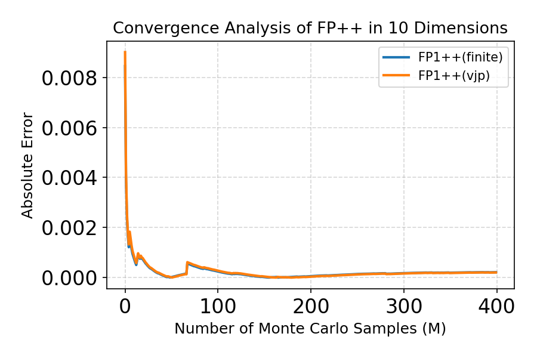
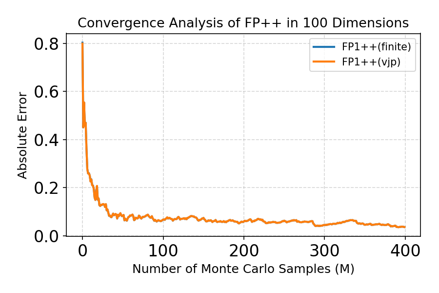
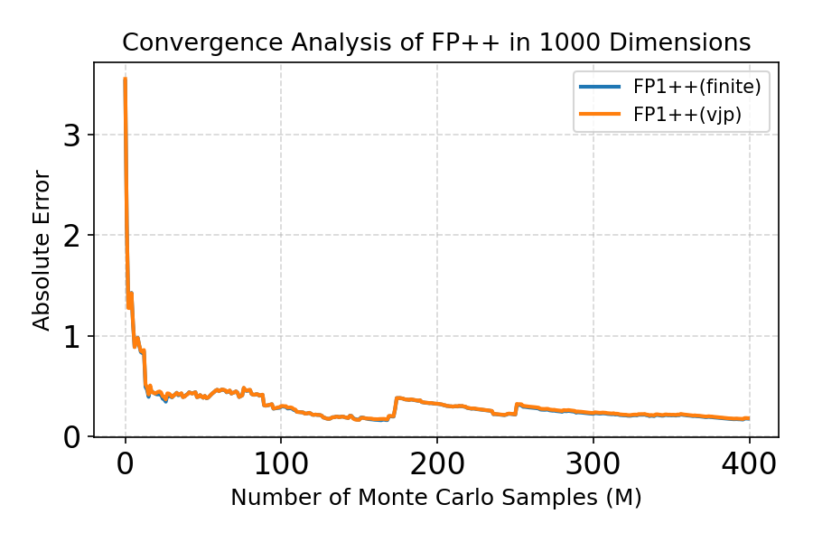

## FP++ Convergence Analysis

### 10D

  

### 100D

  

### 1000D

  

## FP++ Convergence Analysis (VJP vs Finite Difference)

### 10D

  

### 100D

  

### 1000D

  

## Feynman-Kac Correctors (FKC) Results on GMM 10D Benchmark

### Annealed SDE + FKC

  

### Reward-tilted Target + FKC

  

